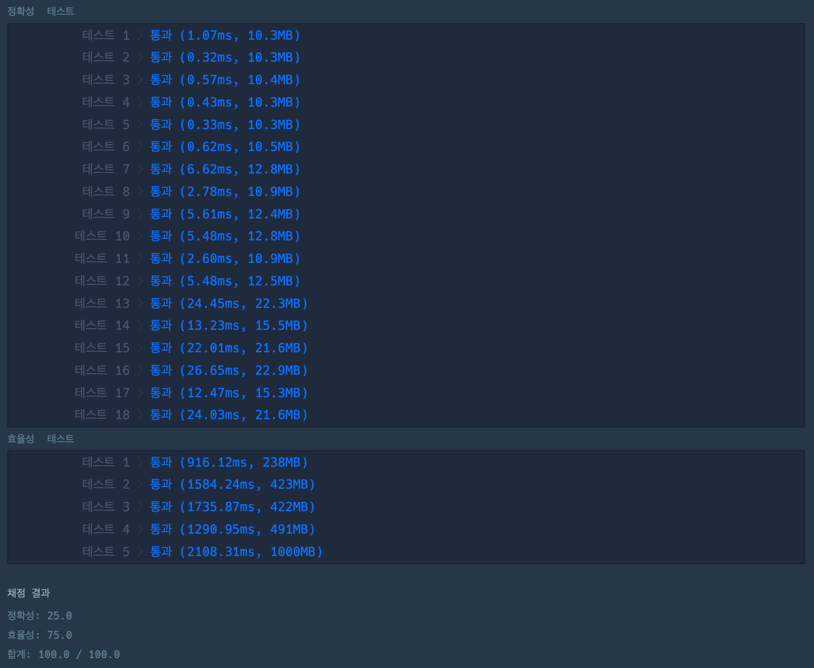

```python
def solution(words, queries):
    result = []
    trie = {}
    trie_reverse = {}

    def append_words(t, w):

        for word in w:
            last_node = t
            length = 1
            for w in word:
                if w in last_node:
                    last_node = last_node[w]
                    length += 1
                    continue
                last_node[w] = {}
                last_node = last_node[w]
                length += 1
            last_node = t
            i = 1
            for w in word:
                last_node = last_node[w]
                if not 'count' in last_node:
                    last_node['count'] = {length-i: 1}
                elif not length-i in last_node['count']:
                    last_node['count'][length-i] = 1
                else:
                    last_node['count'][length-i] += 1
                i += 1

    append_words(trie, words)
    append_words(trie_reverse, map(lambda x: x[::-1], words))

    def search_query(t, q):
        for query in q:
            last_node = t
            for q_idx in range(len(query)):
                q_count = 0
                if query[q_idx] == '?':
                    wc_count = query.count('?')
                    if wc_count == len(query):
                        for a in t:
                            for count in t[a]['count']:
                                if wc_count == count:
                                    q_count += t[a]['count'][count]
                        result.append(q_count)
                        break

                    if q_idx == 0:
                        search_query(trie_reverse, [query[::-1]])
                        break
                    else:
                        for i in last_node:
                            if len(i) == 1 and wc_count in last_node[i]['count']:
                                q_count += last_node[i]['count'][wc_count]
                        result.append(q_count)
                    break
                if not query[q_idx] in last_node:
                    result.append(0)
                    break
                last_node = last_node[query[q_idx]]
    search_query(trie, queries)
    return result
```


